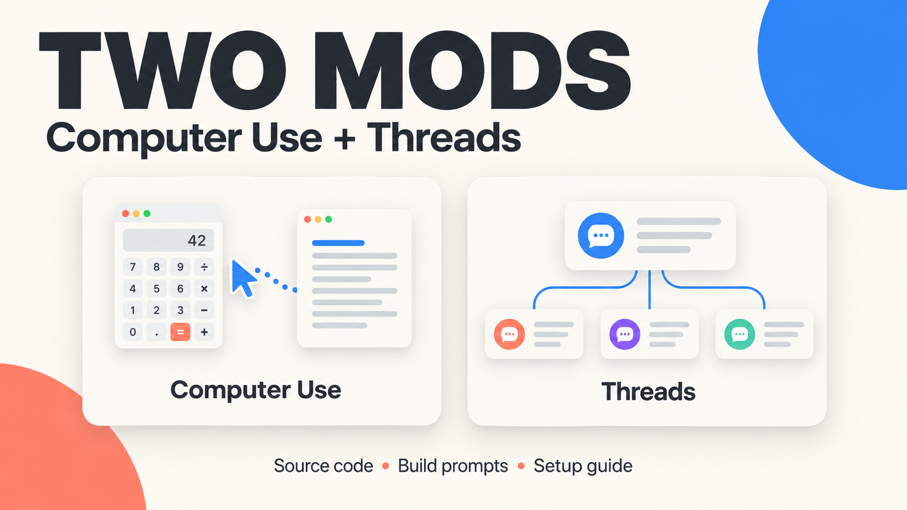
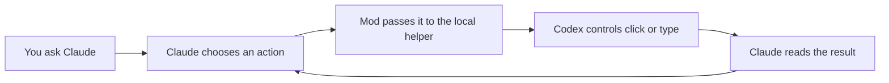
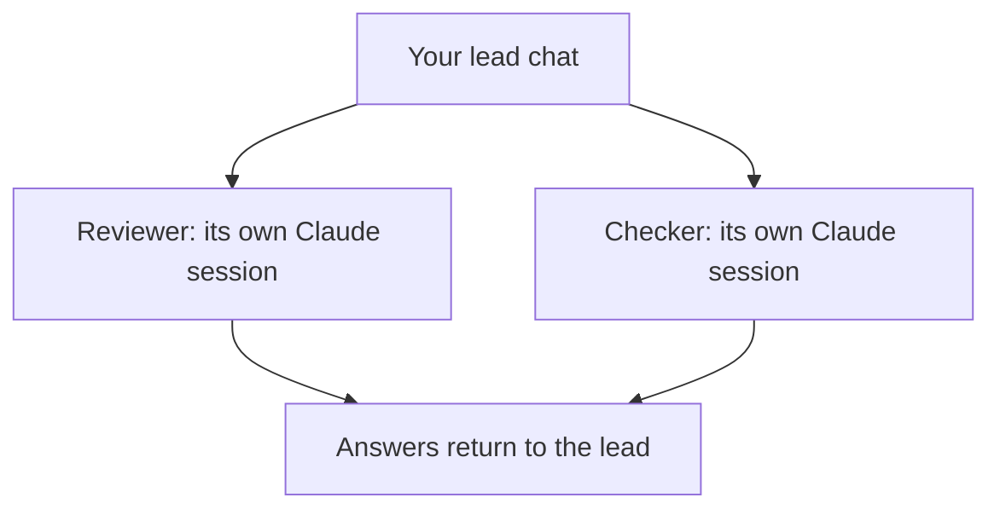

<p align="center"></p>

# Two mods for Claude Code

**Let Claude use Codex’s computer controls. Give one chat a team of real Claude sessions.**

This is the source behind the two mods in the video. Take the working pieces, understand how they fit together, and adapt them to your setup. The complete build prompts are included, so you can also ask Claude to rebuild or extend them.

[Start here](START-HERE.md) · [Quick-start PDF](docs/Quick-Start.pdf) · [Install](docs/INSTALL.md) · [Try the demos](docs/DEMO.md) · [How it works](docs/HOW-IT-WORKS.md) · [Troubleshooting](docs/TROUBLESHOOTING.md)

| Computer Use | Threads |
| :--- | :--- |
| Claude decides what to do. Codex’s local controls click and type in your Mac apps. | Your lead chat starts separate Claude sessions on the models you choose. |
| Per-app approval panel, saved choices, on/off command. | Live status, messages, returned answers, sequential plans and separate project copies. |
| Start with Calculator → TextEdit. | Start with two read-only helpers in a scratch project. |
| [Build prompt](prompts/computer-use-build.txt) · [Source](plugins/codex-computer-use) | [Build prompt](prompts/threads-build.txt) · [Source](plugins/threads) |

## Pick your starting point

**I want to understand it.** Read [How it works](docs/HOW-IT-WORKS.md). No installation needed. The [interactive prompt breakdown](https://two-mods-build-prompts.markkashef.chatgpt.site/) is another way to explore the build prompts.

**I want the existing mods.** Check the requirements below, download or clone this repository, then follow [Install](docs/INSTALL.md). The included setup script checks your machine before it changes anything.

**I want to build my own version.** Give Claude one of the [complete prompts](prompts/). Ask it to inspect the tools your installation actually provides, build one piece at a time, and show each test. These prompts capture the lessons from an iterative build, not a guarantee of a one-shot result.

## Before you install

This is an **unofficial, experimental integration**, captured on **5 October 2026**. It needs the mod-enabled Claude Code runtime, including the `claude-code` hook API. A regular plugin installation without that API is not enough.

- **Both mods:** Claude Code with working mod support. Local tests were run with CLI **2.1.289**.
- **Computer Use:** macOS, the ChatGPT Mac app at its expected installation path, and Codex computer use already set up locally. The proprietary computer-use runtime is **not included**.
- **Threads:** `tmux`, a signed-in Claude terminal session and a trusted working folder. Desktop sidebar access depends on Remote Control availability for your account.
- **Threads (claude --bg), Windows included:** the `threads-bg` plugin is the same mod on Claude Code's own background sessions (`claude --bg`) instead of tmux. It needs a CLI with the `--bg` flag, a signed-in terminal session and a trusted folder; no tmux, no WSL. Install one of the two, not both (they share the `/threads` command and the registry). See [plugins/threads-bg/README.md](plugins/threads-bg/README.md).
- **Setup helper:** Python 3. The computer-use bridge uses the Node runtime shipped inside the ChatGPT app.

No extra API key is required by this code. Your existing account access, usage limits and provider terms still apply. The cost shown by Threads is an **API-equivalent estimate**, not your bill.

## Install, then prove one small thing

From a permanent copy of this repository:

```bash
python3 scripts/setup.py
```

That only checks prerequisites and prints the planned commands. If the checks pass, read [the installation notes](docs/INSTALL.md), then run:

```bash
python3 scripts/setup.py --apply
```

Open a **new Claude Code chat** afterward. In that chat:

```text
/codex-cu status
/threads setup
```

Then use the [exact Calculator → TextEdit prompt](prompts/computer-use-demo.txt) or the [two-helper prompt](prompts/threads-demo.txt). The full [demo checklist](docs/DEMO.md) tells you what success looks like.

> **Permissions are part of the setup.** Computer Use starts with no shared app approvals and auto-approve off. Threads preserves the filmed `bypassPermissions` default for new sessions. For a more restrictive mode, run `/threads mode default` before starting helpers. Use a disposable project for your first run.

## What is actually inside

```text
plugins/
  codex-computer-use/     The routing tool, commands and approval panel
  threads/               The lead chat, sessions, panel, plans and tests
  threads-bg/            The same mod on claude --bg instead of tmux (Windows, macOS, Linux)
bridge/
  launch.mjs             Starts the installed Codex computer-use server
  daemon.mjs             Keeps connections open and handles app approvals
prompts/                 Complete build prompts and copy-ready demos
scripts/setup.py         Read-only checks, then explicit installation
examples/                A small project for the Threads demo
```

Your login, app approvals, chat history and personal files do not come with this repository. The setup creates new empty approval settings on your machine. See [privacy and permissions](docs/PRIVACY.md) for what the mods read and save once running.

## The controls you will use

| Command | Job |
| :--- | :--- |
| `/codex-cu on` / `/codex-cu off` | Change the desktop computer-use route |
| `/codex-cu status` | Inspect the current route and approvals |
| `/codex-cu auto on` / `/codex-cu auto off` | Enable or disable automatic app approval |
| `/codex-cu forget all` | Clear saved always-allowed apps; use `auto off` separately |
| `/threads` | Open the team panel |
| `/threads setup` | Check login, tmux and the current folder |
| `/threads mode default` | Require normal permissions in new helper sessions |
| `/threads cap 4` | Set the live-helper limit |
| `/threads help` | See the full command set |

You can also ask in ordinary language: “Start a Haiku helper to check the README,” “Tell the reviewer to focus on user-facing bugs,” or “Wait for both and bring their answers here.”

## Understand the wiring





The mod does not replace Claude’s reasoning with another model. The computer controls are exposed through MCP, a standard way to connect AI apps to tools. Threads uses Claude’s CLI to start sessions, `tmux` to keep them running, and records and messages to track and steer them. [Read the plain-English walkthrough →](docs/HOW-IT-WORKS.md)

## What was checked

The exported mods passed **102 Threads tests and 7 Computer Use tests** in the installed mod test runner. These use simulated engine behavior; they are not proof of a fresh end-to-end desktop installation. The setup helper has separate tests for empty approvals, preservation of existing files, paths with spaces and component selection.

The final video transcript records a working Calculator/TextEdit demo and Threads sessions appearing in the panel. A new viewer’s installation still needs the [live acceptance checks](docs/DEMO.md). Exact verification scope and packaging changes are recorded in [Verification](docs/VERIFICATION.md).

## Extend it

1. Start from one [build prompt](prompts/), and name one behavior you want to change.
2. Ask Claude to inspect the installed authoring API before coding.
3. Add a focused test and run the existing suite.
4. Test the result in a new chat and a scratch project.

```bash
claude plugin test plugins/threads
claude plugin test plugins/threads-bg
claude plugin test plugins/codex-computer-use
python3 -m unittest discover -s tests
node --test tests/bridge.test.mjs
```

There is no standalone `npm install` step for the mod API. It is supplied by the compatible Claude runtime. Do not download an unrelated package with a similar name to satisfy these imports.

## A few honest limits

- App updates can change the private runtime or mod API. Finding the newest settings folder does not make the bridge update-proof.
- Desktop app behavior varies. The Calculator/TextEdit demo avoids canvas dragging.
- Two helpers can use different apps; the bridge prevents simultaneous ownership of the same app while its lease is active.
- Separate project copies prevent simultaneous file edits, but merging can still produce conflicts.
- Sidebar visibility and native chat tools depend on your installed app and account. The optional native-threads recipe is distinct from the automatic CLI/tmux backend. `threads-bg` has no tmux and cannot type into a helper's prompt or press its permission keys; a helper that stops on a prompt is answered with `claude attach <id>`.

Built with Claude Code; packaged and documented with Codex. Source is provided under the [MIT License](LICENSE). Claude, Codex and ChatGPT belong to their respective providers. This repository is not affiliated with or endorsed by Anthropic or OpenAI.
